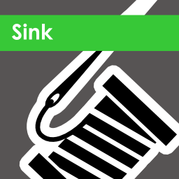
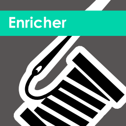
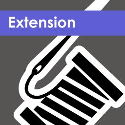
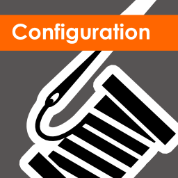
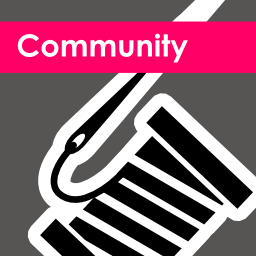

| README.md |
|:---|

<h1 align="center">Serilog Contrib Brand</h1>

This repo serves as a guide and reference to developers, designers, and writers, to create consistent, on-brand content for [Serilog](https://serilog.net)

## Give a Star! :star:

If you like or are using Serilog Community projects, please give this repository a star. Thanks!

## Logos for NuGet Packages

If you would like to use any of the Serilog Contrib icons within your NuGet packages, or anywhere else, the recommended URL's are as follows:

<table>
  <tr>
    <td align="center">Sink</td>
    <td align="center">Enricher</td>
    <td align="center">Extension</td>
    <td align="center">Configuration</td>
    <td align="center">Community</td>
  </tr>
  <tr>
    <td align="center"></td>
    <td align="center"></td>
    <td align="center"></td>
    <td align="center"></td>
    <td align="center"></td>
  </tr>
  <tr>
    <td align="center"><a href="https://cdn.jsdelivr.net/gh/serilog-contrib/brand/logo/sink/serilog-sink-nuget.png" title="Serilog Contrib Sink logo">Link</a></td>
    <td align="center"><a href="https://cdn.jsdelivr.net/gh/serilog-contrib/brand/logo/enricher/serilog-enricher-nuget.png" title="Serilog Contrib Enricher logo">Link</a></td>
    <td align="center"><a href="https://cdn.jsdelivr.net/gh/serilog-contrib/brand/logo/extension/serilog-extension-nuget.png" title="Serilog Contrib Extension logo">Link</a></td>
    <td align="center"><a href="https://cdn.jsdelivr.net/gh/serilog-contrib/brand/logo/configuration/serilog-configuration-nuget.png" title="Serilog Contrib Configuration logo">Link</a></td>
    <td align="center"><a href="https://cdn.jsdelivr.net/gh/serilog-contrib/brand/logo/community/serilog-community-nuget.png" title="Serilog Contrib Community logo">Link</a></td>
  </tr>
</table>

  <table>
    <tr>
      <td align="center">Sink</td>
      <td align="left">https://cdn.jsdelivr.net/gh/serilog-contrib/brand/logo/sink/serilog-sink-nuget.png</td>
    </tr>
    <tr>
      <td align="center">Enricher</td>
      <td align="left">https://cdn.jsdelivr.net/gh/serilog-contrib/brand/logo/enricher/serilog-enricher-nuget.png</td>
    </tr>
    <tr>
      <td align="center">Extension</td>
      <td align="left">https://cdn.jsdelivr.net/gh/serilog-contrib/brand/logo/extension/serilog-extension-nuget.png</td>
    </tr>
    <tr>
      <td align="center">Configuration</td>
      <td align="left">https://cdn.jsdelivr.net/gh/serilog-contrib/brand/logo/configuration/serilog-configuration-nuget.png</td>
    </tr>
    <tr>
      <td align="center">Community</td>
      <td align="left">https://cdn.jsdelivr.net/gh/serilog-contrib/brand/logo/community/serilog-community-nuget.png</td>
    </tr>
  </table>

## License

Logos in the brand repo are licensed under the very permissive [CC0 1.0 Universal license](LICENSE). You may use the artwork to create your own Serilog extensions, create your own Serilog swag items to give away at community events, and use the logos to represent Serilog extensions in related content.

The Serilog logos are copyright of the Serilog authors. 
